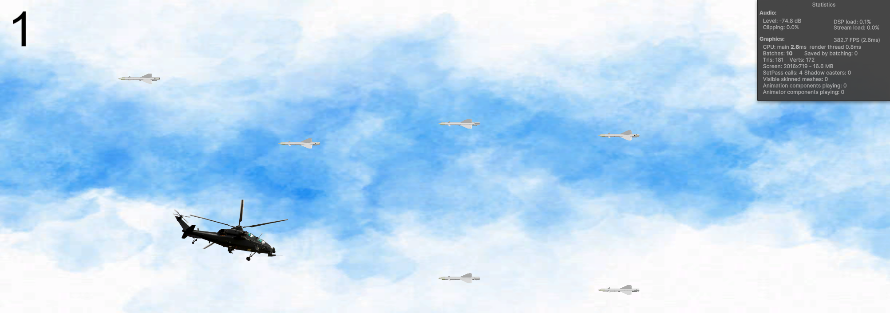

# Unity Helicopter Game
This is a simple 2D game where the player controls a helicopter and navigates through a series of missiles.

## Getting Started
1. Download and install Unity.
2. Clone the repository and open the project in Unity.

## How to Play
- Use the space button to control the helicopter.
- Avoid colliding with the missiles.
- Your score increases for each missile dodged.

## Screenshots

## Contributing
Feel free to submit a pull request to contribute to the project.

## License
This project is licensed under the MIT License.
